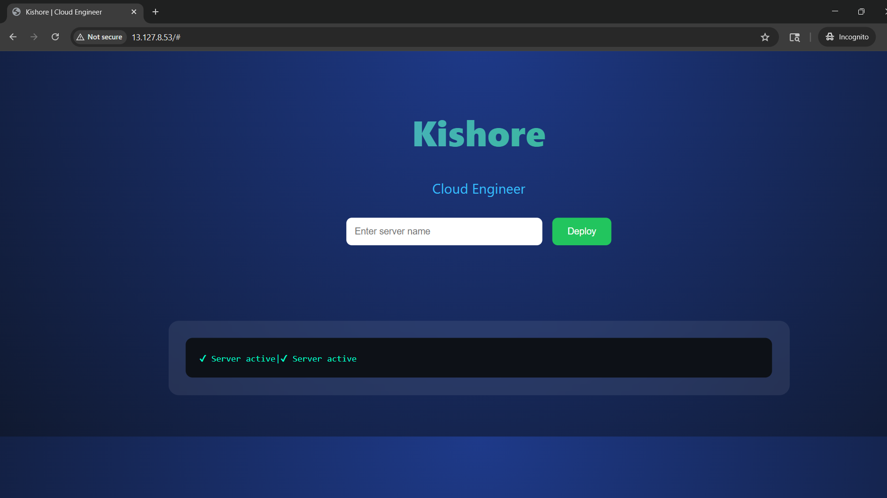
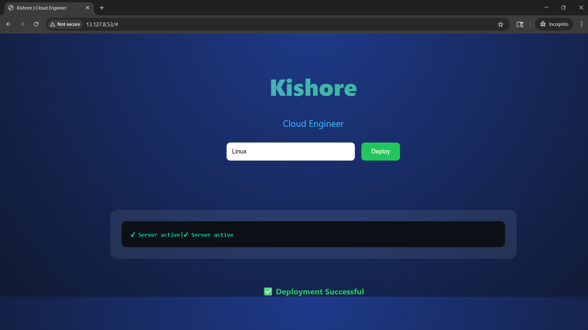
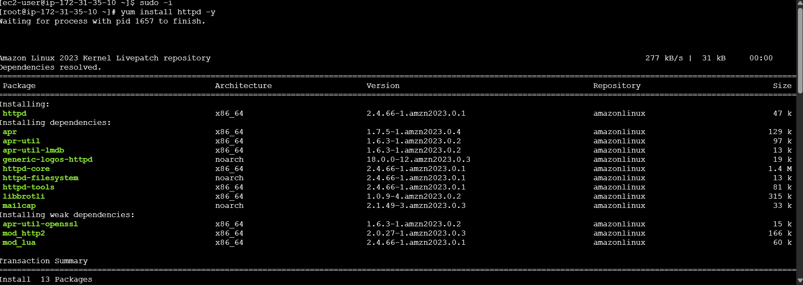

# 🚀 AWS Linux Web Server Deployment

## 📌 Overview

This project demonstrates the deployment of a Linux-based web server on AWS EC2. It includes Apache (httpd) installation, service management, and a simple web interface to simulate server provisioning and verify deployment status.

---

## 🎯 Objectives

* Launch and configure an AWS EC2 instance
* Install and manage Apache (httpd) web server
* Deploy a custom HTML page
* Simulate server provisioning using a modern UI
* Verify server status using terminal and browser

---

## 🧩 Key Features

* Apache web server setup on Linux
* Service monitoring using systemctl
* Public access via EC2 IP address
* Interactive web UI with deployment simulation
* Terminal-style output for system status

---

## 🛠️ Tools & Technologies

* AWS EC2
* Linux (Amazon Linux / RHEL)
* Apache (httpd)
* HTML, CSS, JavaScript

---

## ⚙️ Setup Steps

### 1️⃣ Launch EC2 Instance

* Choose Amazon Linux
* Allow HTTP (port 80) in Security Group

### 2️⃣ Connect to Server

```bash
ssh -i your-key.pem ec2-user@your-public-ip
```

### 3️⃣ Install Apache

```bash
sudo yum update -y
sudo yum install httpd -y
...

### 4️⃣ Start Web Server

```bash
sudo systemctl start httpd
sudo systemctl enable httpd
```
```bash
### 5️⃣ Deploy Web Page

sudo vi /var/www/html/index.html
```
```bash
### 6️⃣ Access Website

Open browser:

```
http://13.127.8.53/
```

---

## 📸 Screenshots






## 📊 Learning Outcomes

* Understanding Linux server setup
* Hands-on Apache configuration
* Basic cloud deployment using AWS
* UI integration with backend concept
* Real-world DevOps fundamentals

---

## 📢 Conclusion

This project provides practical experience in deploying and managing a Linux web server in a cloud environment. It demonstrates essential skills required for Cloud and DevOps roles, including server provisioning, service management, and deployment verification.

---

## 👨‍💻 Author

**Kishore**
Cloud Engineer (Fresher)
